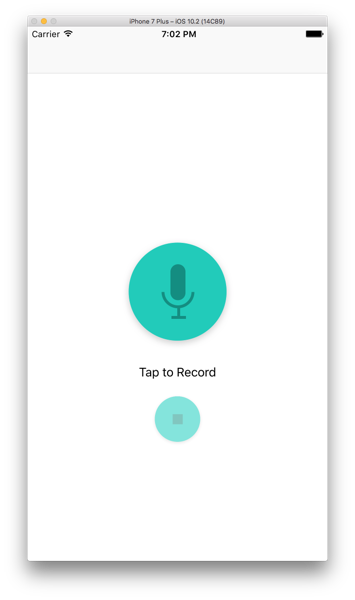
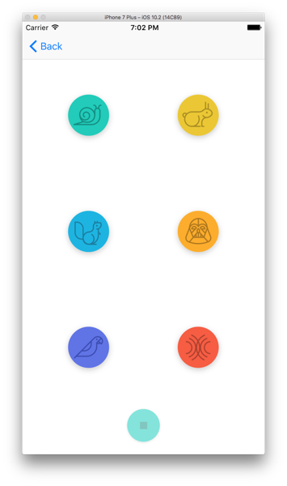

# PitchPerfect Project #

Proyecto a modo de ejemplo para un artículo de mi blog personal **sobre iOS && android**. 

En esta entrada escribo sobre como grabar audio y reproducirlo después modificando ciertos valores como el `pitch` o el `rate` en iOS. En esta ocasión he decidido realizar el proyecto utilizando el lenguaje `Swift 3.0`.

Para más información, visita mi blog: [www.oscargarrucho.com](http://oskarko.github.io/)